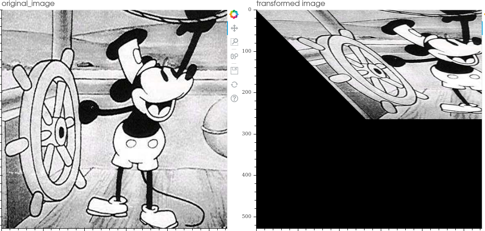
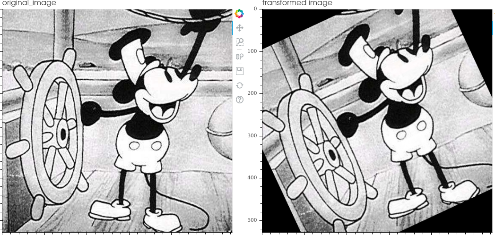
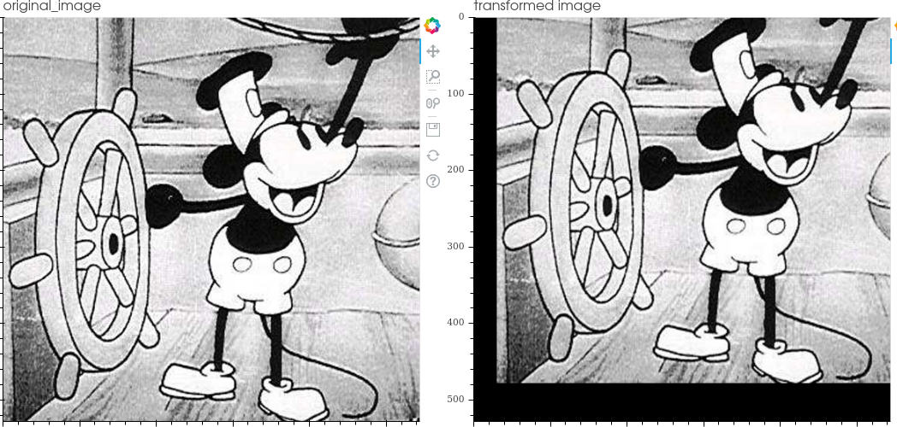
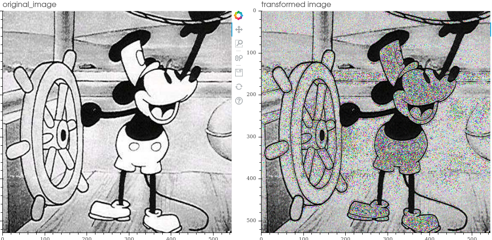
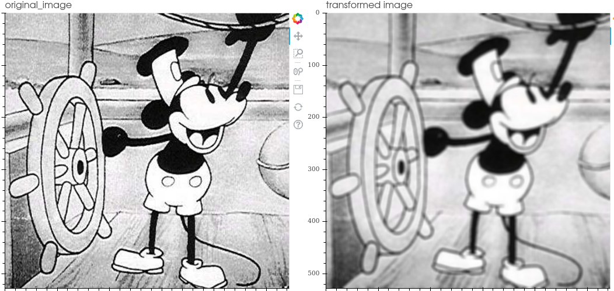

Overview
======================

Functionalities
-----------------

The functionalities on which IdaLib focuses are:

* Offering a **wide variety of image transformations**.
* Allow the **joint transformation**  of:

         * image
         * heatmap
         * mask
         * segmaps
         * keypoints
         * any combination of them

* Offer an **interactive visualization tool** that facilitates the debugging of programs.
* Offer an **efficient operation composition pipeline** (parameterizable at probability and attribute level).
* Offer a **Dataloader** object (as a generator) that integrates the pipeline and allows the supply of any neural network.
* Offer a tool to perform **Image Data Augmentation directly to disk** in order to use the increased dataset directly in future situations

Transformations
-----------------
The transformations included in the library are:

1. **hflip**:
horizontal flipping the image

.. image:: hflip.png
   :width: 50%
   :align: center
2. **vflip**:
vertical flipping the image

.. image:: vflip.png
   :width: 50%
   :align: center
3. **Affine**:
carry out the transformation expressed in the operation matrix

4. **Rotate**:
rotate the image by the indicated degrees counterclockwise

5. **Shear**: linear map that displaces each point in fixed direction, by an amount proportional to its signed distance from the line that is parallel to that direction and goes through the origin

.. image:: shear.png
   :width: 50%
   :align: center
6. **Scale**: scale the image by making it smaller or larger (crop equivalent)

.. image:: scale.png
   :width: 50%
   :align: center
7. **Translate**: moves the image pixels to the positions indicated on each axis

8. **Change gamma**: adjust image's gamma (luminance correction) .

.. image:: gamma.png
   :width: 50%
   :align: center
9. **Change contrast:**: change the image contrast.

10. **Change brightness**: change the image brightness

.. image:: brightness.png
   :width: 50%
   :align: center
11. **Equalize histogram**: equalize the image histogram

.. image:: equalization.png
   :width: 50%
   :align: center

12. **Inject gaussian noise**: gaussian noise is a statistical noise having a probability density function (PDF) equal
to that of the normal distribution

.. image:: gaussian_noise.png
   :width: 50%
   :align: center
13. **Inject salt and pepper noise**: salt-and-pepper noise is a statistical noise compose of white (salt) and black (pepper) pixels

.. image:: salt_pepper_noise.png
   :width: 50%
   :align: center
14. **Inject spekle noise**: Speckle is a granular interference that inherently exists in and degrades the quality of the active radar,
synthetic aperture radar (SAR), medical ultrasound and optical coherence tomography images.
It is applied by adding the image multiplied by the noise matrix -> img + img * uniform_noise

15. **Inject poisson noise**: It is applied by adding Poisson-distributed noise

.. image:: poisson_noise.png
   :width: 50%
   :align: center
16. **Blur**: blur image.

.. image:: blur.png
   :width: 50%
   :align: center
17. **Gaussian blur**: blurring an image by a Gaussian function.

Visualization tool
-------------------

Ida Lib includes a tool to visualize the transformations to facilitate code debugging.
It is an interactive tool developed with the bokeh framework and allows the selection of the data to be displayed in the image.

* The color code is used to differentiate each element and identify it in all the images.
* The dots are numbered in order to see their order
* Allows to compare different transformations obtained by the pipeline
* It also includes the targets in the visualization in order to have a complete view of the elements

.. image:: visualization.png
   :width: 120%
   :align: center

.. note::
    To test the visualization tool you can try this example:
    https://github.com/raquelvilas18/ida_lib/blob/master/examples/pipeline_usage.py

.. warning::
    For the visualization tool a bokeh server is deployed; therefore it is only possible to have one open execution.
    It is important to close previous runs in order to open new windows
