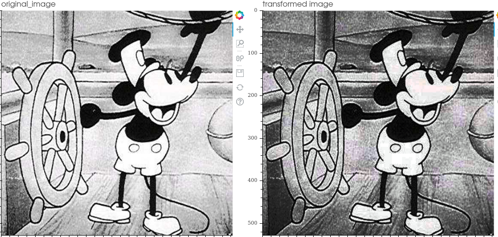

Transformations
-----------------
The transformations included in the library are:

1. **hflip**: horizontal flipping the image

2. **vflip**: vertical flipping the image

.. image:: vflip.png
   :width: 50%
   :align: center

3. **Affine**:carry out the transformation expressed in the operation matrix

.. image:: affine.png
   :width: 50%
   :align: center

4. **Rotate**:rotate the image by the indicated degrees counterclockwise

.. image:: rotate.png
   :width: 50%
   :align: center

5. **Shear**: linear map that displaces each point in fixed direction, by an amount proportional to its signed distance from the line that is parallel to that direction and goes through the origin

.. image:: shear.png
   :width: 50%
   :align: center

6. **Scale**: scale the image by making it smaller or larger (crop equivalent)

7. **Translate**: moves the image pixels to the positions indicated on each axis

.. image:: translate.png
   :width: 50%
   :align: center

8. **Change gamma**: adjust image's gamma (luminance correction) .

.. image:: gamma.png
   :width: 50%
   :align: center

9. **Change contrast:**: change the image contrast.

.. image:: contrast.png
   :width: 50%
   :align: center

10. **Change brightness**: change the image brightness

.. image:: brightness.png
   :width: 50%
   :align: center

11. **Equalize histogram**: equalize the image histogram

12. **Inject gaussian noise**: gaussian noise is a statistical noise having a probability density function (PDF) equal
to that of the normal distribution

.. image:: gaussian_noise.png
   :width: 50%
   :align: center

13. **Inject salt and pepper noise**: salt-and-pepper noise is a statistical noise compose of white (salt) and black (pepper) pixels

.. image:: salt_pepper_noise.png
   :width: 50%
   :align: center

14. **Inject spekle noise**: Speckle is a granular interference that inherently exists in and degrades the quality of the active radar,
synthetic aperture radar (SAR), medical ultrasound and optical coherence tomography images.
It is applied by adding the image multiplied by the noise matrix -> img + img * uniform_noise

.. image:: spekle_noise.png
   :width: 50%
   :align: center

15. **Inject poisson noise**: It is applied by adding Poisson-distributed noise

16. **Blur**: blur image.

.. image:: blur.png
   :width: 50%
   :align: center

17. **Gaussian blur**: blurring an image by a Gaussian function.

.. image:: gaussian_blur.png
   :width: 50%
   :align: center